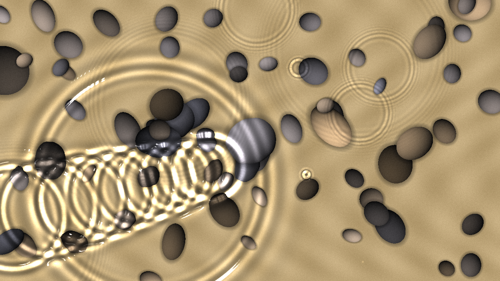
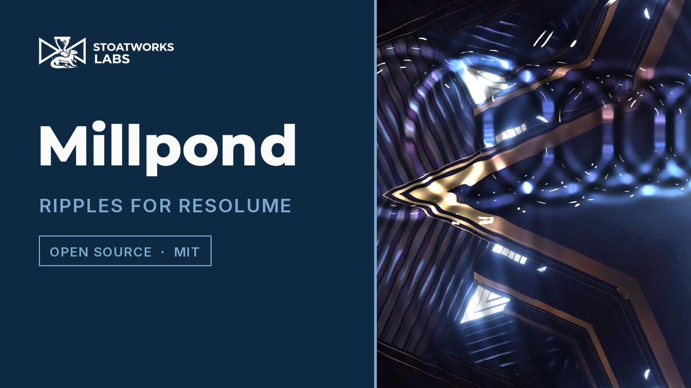
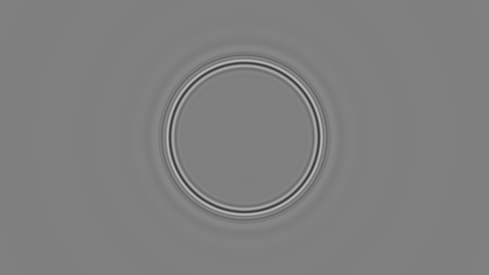

# millpond

> **AI-assisted project.** This codebase was created with [Claude](https://claude.com/claude-code)
> (Anthropic), directed and reviewed by a human author. It has **never been
> loaded into Resolume**. Everything below is measured by an offline harness
> that drives the real plugin class in a headless GL context. The central
> claims are measured, not asserted. `mptest --gravity` and `--quiet` compare
> the plugin's water, at every grid point, with the exact Cauchy–Poisson
> integral for the same crater, evaluated in double precision (they agree to
> **0.01%**). `--quiet` also finds the still disc inside the ring and the Airy
> edge of it where the dispersion relation puts them. `--refraction` checks
> the bed's displacement against Snell's law at two rasters, and `--fresnel`
> checks the reflection against the exact Fresnel reflectance. `--caustics`
> requires the caustic net to conserve light and to focus it by the landing
> map's Jacobian. `mptest --negative` re-runs every check against a
> deliberately wrong model and fails if any of them *passes* (see
> [Status](#status)). A control sweep fails if any parameter turns out to do
> nothing.

Ripples for Resolume Arena/Avenue, as an FFGL effect. Drop a pebble, skim a
stone, let it rain. The clip becomes the bed of a pond, and you look down at it
through the water.

A skim across the lower left (its hops shorten towards the sink on the
right), the rings of a pebble dropped a second and a half earlier, and a light
rain. The picture under the water is the harness's own card. Rendered by the
plugin's offline harness (`mptest`), not captured from Resolume.

*[Watch it](https://www.youtube.com/watch?v=oAbXjVXFwYA) — 52 seconds: one pebble and the still water it leaves, two pebbles whose rings cross,
two skimmed stones, a walled pond throwing its waves back, and rain with the
sunlight bent through it. Every frame is the real plugin's output, rendered by its
offline harness from Resolume's own demo clips rather than captured from Resolume.*

<!-- downloads:start -->

## Download

**[v0.1.0](https://github.com/stoatworks-labs/millpond/releases/tag/v0.1.0)** — prebuilt for macOS and Windows. Pick your platform:

<b>macOS</b> — Universal (Apple Silicon + Intel)

| Build | Download | Size |
| --- | --- | --- |
| Universal (Apple Silicon + Intel) · .dmg disk image | [`millpond-0.1.0-macos-universal.dmg`](https://github.com/stoatworks-labs/millpond/releases/download/v0.1.0/millpond-0.1.0-macos-universal.dmg) | 254 KB |
| Universal (Apple Silicon + Intel) · .zip archive | [`millpond-macos-universal.zip`](https://github.com/stoatworks-labs/millpond/releases/latest/download/millpond-macos-universal.zip) | 214 KB |

<b>Windows</b> — x64

| Build | Download | Size |
| --- | --- | --- |
| x64 · .exe installer | [`millpond-0.1.0-windows-x86_64-setup.exe`](https://github.com/stoatworks-labs/millpond/releases/download/v0.1.0/millpond-0.1.0-windows-x86_64-setup.exe) | 233 KB |
| x64 · .zip archive | [`millpond-windows-x86_64.zip`](https://github.com/stoatworks-labs/millpond/releases/latest/download/millpond-windows-x86_64.zip) | 126 KB |

All builds, checksums and release notes: [github.com/stoatworks-labs/millpond/releases](https://github.com/stoatworks-labs/millpond/releases).

macOS builds are signed and notarised and open normally. The Windows builds are unsigned, so SmartScreen warns once.

<!-- downloads:end -->

## The one idea

**The water obeys the linear water-wave equations, exactly, and the light
obeys Snell and Fresnel.** Nothing is drawn. A pebble is a crater pushed into
the surface. From then on every wavelength travels at the speed the dispersion
relation gives it,

    ω² = ( g k + (σ/ρ) k³ ) tanh( k h )

(gravity, surface tension and depth), and dies away at the rate viscosity
gives it. Every frame the surface goes through a Fourier transform on the GPU
and each wave is advanced by exactly the right phase for the time that has
passed. There is no time step to go unstable and no numerical dispersion: the
dispersion is the formula.

What falls out of that, rather than being arranged:

- **The still disc inside the ring.** Surface tension gives water a slowest
  speed at which a ripple can carry energy: 17.8 cm/s, at a wavelength of
  4.4 cm. Nothing can be inside a disc growing at that speed. So a dropped stone
  leaves a ring with calm water in the middle, and the ring's inner edge has
  the soft, banded shape of an Airy function.
- **Long waves out front, short ones behind.** Without surface tension, a
  crater gives the classic Cauchy–Poisson pattern: at radius r and time t the
  wavelength is 8πr²/(g t²), longest at the leading edge.
- **Shallow water holds its long waves back** to √(g h), so the same stone in
  a centimetre of water throws a different ring.
- **The picture wobbles by exactly as much as it should.** The view ray bends
  at the surface (n = 1.333) and lands on the bed a depth below.
- **The caustic net on the bed.** Sunlight refracted through the same surface
  bunches into bright lines where the water focuses it. It is splatted as a
  mesh whose triangles each carry their own light, so the total is conserved
  however violent the net gets. The sun's size blurs it by depth × tan(radius),
  so deep water and a hazy sky wash it out.
- **The glints.** The exact Fresnel reflection of the sky is 2% looking
  straight down and rises towards the edges of a slope. Where a facet points
  the sun at the camera, you get the sun.

**The same Depth drives both halves.** A shallow pond both bends the picture
less and slows its long waves. It is one depth, so it is one control.

View → Height, three seconds after a 1.5 cm pebble on 2 m of clean
water. The disc inside the ring is still, because no ripple on water can carry
energy slower than 17.8 cm/s. The ring's edge sits within a centimetre of
where the Airy function says it must. Rendered by `mptest`.

### A skimmed stone

Each bounce of a skimmed stone costs about the same energy
([Bocquet, 2003](https://doi.org/10.1119/1.1519232)). So after n bounces
V² = V₀²(1 − n/N), and each hop is a projectile. **The hops get shorter
linearly and quicker as a square root**, which is what a real skim looks like.
After N touches it has nothing left and sinks with a full-sized plop. The
touches go into the water as craters at the right places and times, and the
water does the rest: a line of rings, oldest and widest where the throw
started.

## Controls

- **Pond:** Pond Size (the frame's height in metres, 0.1 to 20) and Depth
  (2 mm to 2 m). Surface Tension: 0 is pure gravity waves, and the middle of
  the travel is clean water. Viscosity runs from water to golden syrup, which
  really is overdamped at short wavelengths, and the propagator knows it.
  Speed: 0 freezes the water. Banks: *Open* is a lake, where what leaves the
  frame never comes back. *Walls* is a pool, where the edges reflect exactly
  to every order. Detail is the grid (256 to 2048 along the domain's long
  side). Still flattens the water.
- **Pebble:** Drop, Pebble X/Y, Pebble Size, Splash and Scatter. The crater's
  spectrum peaks at k = 2/a, so the size decides which part of the dispersion
  curve it rings: a small pebble makes capillary ripples, a big one throws
  gravity rings.
- **Skim:** Skim, Heading, Throw Speed, Skim Angle and Bounces. The stone
  comes in from the bank on the far side of Pebble X/Y and passes through
  that point.
- **Rain:** Rain (drops per second, a Poisson process in water-time, so a
  frozen pond has no rain on it) and Rain Size. Raindrops have their own
  crater depth; Splash is the pebble's.
- **Audio:** Audio (Resolume's FFT buffer). Audio Pebbles is the onset
  detector's sensitivity and on/off switch: each hit drops a pebble, its
  splash following how hard the hit was. Audio Rain thickens the rain with the
  level.
- **Light:** Caustics (1 is physical), Sun Elevation, Sun Azimuth and Sun Size
  (angular radius: 0.27° is the real sun, several degrees is haze). Reflection
  (1 is the exact Fresnel term), Sky and Glint.
- **Output:** View shows *Picture*, the effect. It can also show one model on
  its own: *Height*, *Slope* or *Caustics*, which also work as a source of
  pure water patterns. Mix.

A camera looking straight down only sees the sun in a facet tilted by half the
sun's zenith angle. Ripples rarely tilt more than a few degrees, so glints
need a high sun, and the default is 85°.

## Status

**v0.1.0, 2026-09-23, and honestly early.**

It has been loaded into **Resolume Arena 7.27.1 on Windows only, and only on
a software rasteriser**. The machine is win-lab, an x64 Windows 11 VM with
no GPU, where OpenGL is Mesa llvmpipe 26.2.0. The DLL was built there with
MSVC 2022 and vcpkg's `x64-windows-static-md`. In Arena:

- it loaded, and was registered and listed as `SW Millpond` / `MP01`, an
  effect;
- all 40 controls came back with the declared name, order, type, range and
  default;
- the shaders compiled and it rendered. The plugin's own log recorded
  `GL vendor=Mesa … 4.5 (Core Profile)` and `initialised`, and it read
  Arena's clock as milliseconds;
- Arena stayed up and logged no errors through the whole control sweep.

That sweep reported five controls as having no effect: Surface Tension,
Banks, Pebble Size, Heading and Throw Speed. Each one shapes the next pebble
or skim, or acts on waves that reach the bank. The probe never presses Drop
or Skim, so it cannot see them. The harness here measures all five live. The
rest of the controls moved the picture, but the rain keeps the water moving
on its own, so a pass there says less than it would for a still picture.

`oxbow selftest` on the same VM rendered 120 frames with no GL error. Nothing
is known about performance on Windows, and it has never been loaded into
Arena on macOS. Offline, `oxbow probe` reads the bundle the way a host does,
and `oxbow selftest` instantiates it through the host's own path. There is no
OpenFX port and no factory presets. Everything below was
built and measured on macOS (Apple Silicon, M4 Max).

What is measured, on this machine:

| | |
| --- | --- |
| the transform | the GPU's forward-and-back FFT and its spectral derivatives against an O(N²) double-precision DFT: **2.2e-7** relative |
| each wave | four regimes (deep gravity, capillary-gravity, shallow, overdamped syrup) against the textbook damped oscillator, to **5 figures** |
| gravity rings | against the exact Cauchy–Poisson integral, at every grid point out to 1.2 m, at 1 s and 2.5 s: **0.006%** and **0.007%** of the ring |
| capillary rings | the same with surface tension, at 3 s and 5 s: **0.019%** and **0.018%** |
| the still disc | inside 0.85 c_min t, **0.77%** (at 3 s) and **0.01%** (at 5 s) of the ring's height; the ring's edge **1.2 cm** and **0.7 cm** from the Airy prediction |
| shallow water | in 1 cm of water the front is at **0.634 m** after 2 s; √(g h) t is 0.626 m |
| banks | Open keeps **0.0000** of the frame's energy after 10 s, and so does a 20 m, 2 m deep pond after 90 s. Walls keeps **0.844**; the walled pond is its own mirror image to **3.6e-5** |
| refraction | the bed's displacement against Snell's law, both axes, at 480×270 and 1280×720: worst **0.036 mm** error on 9.3 mm of displacement |
| Fresnel | **0.02037** looking straight down; worst error **1.8e-4** on slopes to 50° |
| caustics | still water **1 ± 1.2e-7** at every pixel; heavy rain with the sun sharp and hazy: mean light **1.0017**; a plane wave focuses to 1/(dx′/dx) in every column, with the sun overhead and 55° up on either side (the oblique suns pin its direction) |
| still water | the output is the picture to **3e-7** with Reflection at 0, and exactly (1 − R₀)·picture + R₀·sky with it at 1. The same holds for a host texture padded beyond its picture (MaxUV), and rain never shows the padding |
| the skim | 10 touches and the sink; hops d₀(1 − n/N) to **5e-8 m**; flights 2V₀√(1 − n/N) sin β/g. A throw harder than the pond stops at the far bank |
| rain | 776 drops in 150 s against 768 ± 111 expected; none at Speed 0 |
| audio | silence drops nothing; a beat every half second drops **19** pebbles in 10 s. The 20th hit is on frame 0, where nothing can have risen yet |
| GL state | viewport, vertex array, program, active unit, framebuffer, blend, scissor, clear colour and eight texture units are all as the host left them, over three frames |
| negative controls | **13** deliberately wrong models, **all 13** detected |
| dead controls | **31** parameters, all live |

Render cost (`mptest --bench`, busy rain): **0.9 ms/frame at 720p, 1.0 at
1080p, 2.4 at 4K** at the default Detail. Detail sets the grid, not the
raster, so the 1080p frame costs 0.85 ms at Detail 512 and 4.4 ms at 2048.

What is **not** verified, and is the honest limit of this release:

- **Linear theory.** The craters are deeper than linear theory strictly
  covers (Splash defaults to half the radius), and the water responds
  linearly anyway. No breaking, no crown splash, no Worthington jet, and no
  bumps where two big waves cross.
- **Viscous damping is Lamb's weak-damping rate** (2νk²), applied as a damped
  oscillator. That is exact for water and only a model for syrup, where real
  creeping flow changes the dispersion too.
- **The camera looks straight down**, so there is no perspective and no
  horizon, and the sky it reflects is one colour.
- **Events land on frames.** A pebble goes into the frame in which its time
  falls, up to one frame early. At 60 fps that is 17 ms, a tenth of a skim's
  quickest hop.
- **The Open banks' sponge** is tuned to take six e-foldings out of the
  fastest wave the pond can hold, on the way in alone, and more out of every
  slower one. `--banks` measures it on a half-metre pond; nothing has measured
  the reflection of a sponge that strong on the shortest ripples.

**Browser demo:** [millpond-demo.stoatworks-labs.com](https://millpond-demo.stoatworks-labs.com)
runs the plugin's eight shaders — the FFT, the exact propagator, the caustic
mesh and the composite — ported to WebGL2, and `demo/tools/check_shaders.py`
holds that GLSL character-for-character against `source/Shaders.cpp`
(`tools/verify.sh` runs it). The CPU half — the controls, the skim schedule, the
PCG rain, the grid and the frame sequence — is a hand translation to JavaScript
that nothing checks but a reader. Drop, Skim and Still are buttons there; the
audio controls are absent.

## Build

C++17 + GLSL 4.10, CMake, FFGL 2.1 (SDK vendored as a submodule). macOS builds
are universal (arm64 + x86_64); Windows needs GLEW via vcpkg.

    git clone --recursive https://github.com/stoatworks-labs/millpond
    cmake -B build -DCMAKE_BUILD_TYPE=Release
    cmake --build build
    cmake --install build          # into Resolume's Extra Effects

## Building and testing

The offline harness renders the real plugin class headlessly:

    ./build/mptest --out /tmp/frame.png --drop 10 --skim 60   a frame, with a pebble and a skim
    ./build/mptest --fft                  the transform against a double-precision DFT
    ./build/mptest --modes                each wave against the textbook oscillator
    ./build/mptest --gravity              the rings against the exact integral
    ./build/mptest --quiet                the still disc, its Airy edge, and the integral again
    ./build/mptest --shallow              nothing outruns sqrt( g h )
    ./build/mptest --banks                walls hold, open water lets go
    ./build/mptest --refraction           Snell, at two rasters
    ./build/mptest --fresnel              the reflectance
    ./build/mptest --caustics             light conserved, and focused by the Jacobian
    ./build/mptest --still                flat water bends nothing
    ./build/mptest --skim-check           the hops shorten linearly
    ./build/mptest --rain                 Poisson at the rate asked for
    ./build/mptest --audio                a beat drops a pebble a beat
    ./build/mptest --state                the host's GL state comes back as it went in
    ./build/mptest --negative             every check above, against a wrong model
    ./build/mptest --bench                720p through 4K
    python3 tools/sweep.py                no control is silently dead
    tools/verify.sh                       all of it, in about eighty seconds

Filming uses the fleet's frame format and cue sheets:

    ./build/mptest --film 720 --size 1280x720 --script docs/demo.cues \
      | ffmpeg -f rawvideo -pix_fmt rgba -s 1280x720 -r 60 -i - demo.mp4

<!-- attributions:start -->
This project is built on other people's work — see [ATTRIBUTIONS.md](ATTRIBUTIONS.md).
<!-- attributions:end -->

## Licence

MIT.

The physics is textbook: linear water waves with surface tension and finite
depth, Lamb's viscous damping, the Cauchy–Poisson problem, the method of
images, Snell and Fresnel. The equal-energy-per-bounce model of a skimmed stone
is from Bocquet's paper. Nothing is copied from anyone's source.
